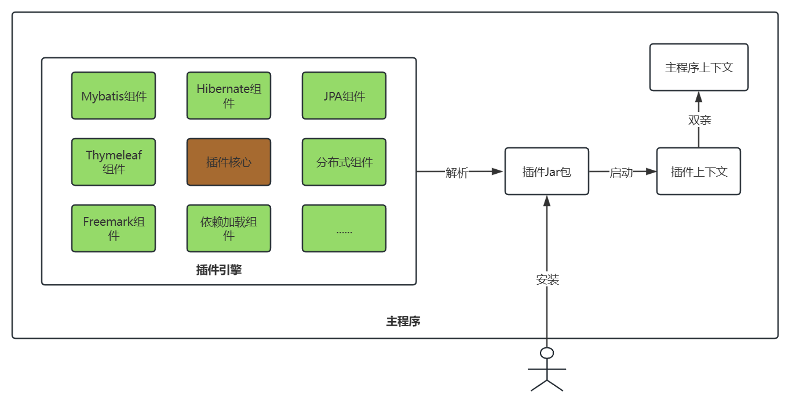

<div align="center">
<span style="font-size: 30px;font-weight:bold">
Spring 插件化开发框架
</span>

[🤔Reporting Issues][Issues-url]   [📘English Documentation][english-url]

[![license][license-image]][license-url]
[![build][build-image]][build-url]
[![jdk][jdk-image]][jdk-url]
[![hutool][hutool-image]][hutool-url]
</div>

[license-image]: https://img.shields.io/badge/license-Apache%202.0-green
[stars-image]: https://badgen.net/github/stars/jujunchen/spring-hot-plugin
[build-image]: https://img.shields.io/badge/build-Spring%20Boot%202.7.18-45e91c
[jdk-image]: https://img.shields.io/badge/JDK-8+-green
[hutool-image]: https://img.shields.io/badge/hutool-5.8.4-green

[license-url]: ./LICENSE
[build-url]: https://github.com/spring-projects/spring-boot
[jdk-url]: https://www.oracle.com/java/technologies/javase/javase-jdk8-downloads.html
[hutool-url]: https://github.com/dromara/hutool
[Issues-url]: https://github.com/jujunchen/spring-hot-plugin/issues
[english-url]: README.en.md

## 介绍
Spring 插件化开发框架，轻、快、易、稳，无需暴露核心模块代码，降低代码耦合，动态更新，提升开发效率。

轻：轻量

快：启动速度快

易：使用简单，原生spring编程

稳：稳定，兼容性强

## 支持特性
目前插件支持的特性：
- 支持插件引用主程序Spring Bean
- 插件代码与主程序代码隔离
- 支持热加载普通类、各类Spring Bean
- 支持热加载Controller控制器
- 支持热加载定时任务
- 支持插件中使用第三方依赖,jar、dll文件
- 支持主程序监听插件启动卸载事件
- 支持Mybatis

## 软件架构




## 安装教程
> 目前项目还在开发中，插件核心包暂未发布到maven仓库，请下载源码构建

### 源码构建
1. git clone 本项目
2. IDEA导入项目，根目录运行 mvn clean install(或者上传到私服)
3. 主程序中引入依赖，修改版本为最新版本
```xml
<!--引入插件包-->
<dependency>
    <groupId>csdn.itsaysay.plugin</groupId>
    <artifactId>spring-hot-plugin-core</artifactId>
    <version>${lastVersion}</version>
</dependency>
```


### 使用说明
1. 在你的主程序中，参考`spring-hot-plugin-demo`项目创建一个安装插件的接口
2. 配置插件
```yml
plugin:
  #是否启用插件功能
  enable:
  #运行模式，开发环境: dev，生产环境: prod
  runMode:
  #在卸载插件后, 备份插件的目录
  backupPath:
  #插件的路径，如果插件路径下存在插件会自动加载
  pluginPath:
  #扫描的包路径
  basePackage:
```
3. 插件开发
>- 参考`plugin-demo`，将主程序以`<scope>provided</scope>`的生命周期引入maven，这样就可以在插件中引用主程序的Bean。
>其他就如同平时开发方式一样
>-  打包工具，同样参考plugin-demo 的 pom文件配置 `spring-hot-plugin-maven`
4. 安装插件
- 通过前面创建的接口进行`动态`安装，选择`-repackage`结尾的jar包（**推荐**）
- 直接放入插件安装目录，需要重启主程序

## 参与贡献

1.  Fork 本仓库
2.  新建 Feat_xxx 分支
3.  提交代码
4.  新建 Pull Request
