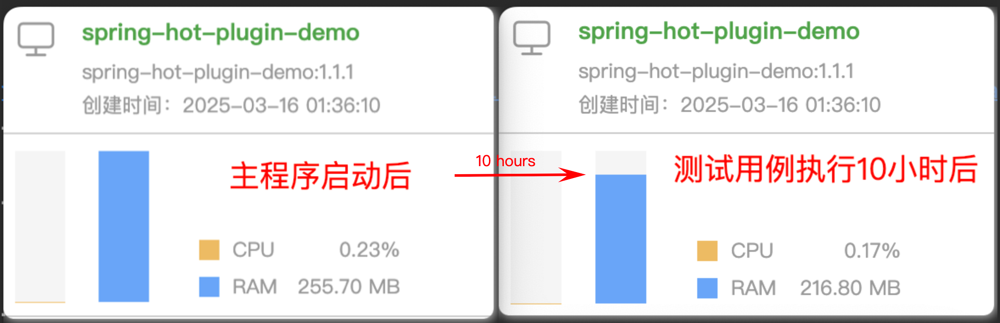

<div align="center">
<span style="font-size: 30px;font-weight:bold">
Spring Plugin Development Framework
</span>
  
[🤔Reporting Issues][Issues-url]   [📘中文][chinese-url]

[![license][license-image]][license-url]
[![build][build-image]][build-url]
[![jdk][jdk-image]][jdk-url]
[![hutool][hutool-image]][hutool-url]
</div>

[license-image]: https://img.shields.io/badge/license-Apache%202.0-green
[stars-image]: https://badgen.net/github/stars/jujunchen/spring-hot-plugin
[build-image]: https://img.shields.io/badge/build-Spring%20Boot%202.7.18-45e91c
[jdk-image]: https://img.shields.io/badge/JDK-8+-green
[hutool-image]: https://img.shields.io/badge/hutool-5.8.4-green

[license-url]: ./LICENSE
[build-url]: https://github.com/spring-projects/spring-boot
[jdk-url]: https://www.oracle.com/java/technologies/javase/javase-jdk8-downloads.html
[hutool-url]: https://github.com/dromara/hutool
[Issues-url]: https://github.com/jujunchen/spring-hot-plugin/issues
[chinese-url]: README.zh-cn.md

## Introduction
A lightweight, fast, easy, and stable Spring-based plugin development framework. It does not require exposing core module code, reduces code coupling, supports hot reloading for dynamic updates, and improves development efficiency.

Lightweight: Lightweight

Fast: Fast startup

Easy: Easy to use, native Spring programming

Stable: Stable, strong compatibility

## Supported Features
v1.2 (Under Development)
- Support for distributed deployment
- Support for Freemarker template engine

v1.1.1
- Support for using third-party dependencies in plugins, including jar and dll files
- Support for MyBatis and MyBatisPlus

v1.0
- Support for subclasses referencing parent Spring Beans
- Isolation of plugin code from main program code
- Support for hot reloading of ordinary classes and various Spring Beans
- Support for hot reloading of Controller controllers
- Support for hot reloading of scheduled tasks
- Support for using third-party dependencies in plugins
- Support for the main program to listen to plugin startup and uninstallation events

## Principle


Based on Spring's applicationContext and classLoader, hot reloading of classes in plugins is performed. During uninstallation, efforts are made to cut off GC ROOTs to avoid memory leaks.

## Installation Guide
- spring-hot-plugin-common: Plugin common package
- spring-hot-plugin-core: Plugin core package
- spring-hot-plugin-loader: Plugin dependency loading package
- spring-hot-plugin-maven: Plugin Maven packaging tool
- spring-hot-plugin-mybatis: Plugin MyBatis dependency package
- spring-hot-plugin-example: Plugin example project

### Maven Installation
#### Using controller, scheduled tasks, third-party dependencies
```xml
<!--Introduce plugin core package-->
<dependency> 
    <groupId>vip.aliali.spring</groupId> 
    <artifactId>spring-hot-plugin-core</artifactId> 
    <version>${lastVersion}</version> 
</dependency>
```
#### Using Mybatis, Mybatis-plus
```xml
<!--Introduce mybatis dependency package-->
<dependency> 
    <groupId>vip.aliali.spring</groupId> 
    <artifactId>spring-hot-plugin-mybatis</artifactId> 
    <version>${lastVersion}</version> 
</dependency>
```
### Source Code Build
1. git clone this project
2. Import the project in IDEA, run `mvn clean install` in the root directory (or upload to a private repository)
3. Introduce the plugin core package in the main program, modify the version to the latest version

```xml
<!--Introduce plugin core package-->
<dependency> 
    <groupId>csdn.itsaysay.plugin</groupId> 
    <artifactId>spring-hot-plugin-core</artifactId> 
    <version>${lastVersion}</version> 
</dependency>
```

4. Introduce other dependencies as needed

### Usage Instructions
1. Introduce plugin dependencies in the main program's pom.xml
2. In the main program, refer to the `spring-hot-plugin-demo` project to create an interface for installing plugins
3. Configure the plugin

```yml
plugin:
  #Whether to enable plugin functionality
  enable:
  #Run mode, development environment: dev, production environment: prod
  runMode:
  #Backup directory after uninstalling the plugin
  backupPath:
  #Plugin path, if the plugin path exists, it will be automatically loaded
  pluginPath:
  #Package path to scan
  basePackage:
```
4. Plugin Development
>- Refer to `plugin-demo`, introduce the main program with `<scope>provided</scope>` lifecycle in Maven, so that the plugin can reference the main program's Beans.
   >Other development methods are the same as usual
>- Packaging tool, refer to the pom file configuration of `plugin-demo` for `spring-hot-plugin-maven`
5. Install Plugin
- Perform `dynamic` installation through the previously created interface, select the jar package with `-repackage` suffix (**Recommended**)
- Directly place it in the plugin installation directory, requires restarting the main program

## Performance Test
Test Case:
Simulate frequent plugin installation, uninstallation, and data operations to observe memory consumption.

Docker container maximum memory: 256MB

1. Install plugin-demo-mybatis plugin
2. Add data
3. Query data
4. Delete data
5. Uninstall plugin-demo-mybatis plugin



## Contribution

1. Fork this repository
2. Create a new Feat_xxx branch
3. Submit code
4. Create a Pull Request
